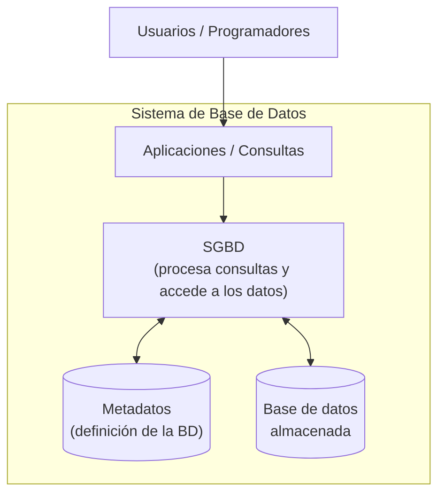
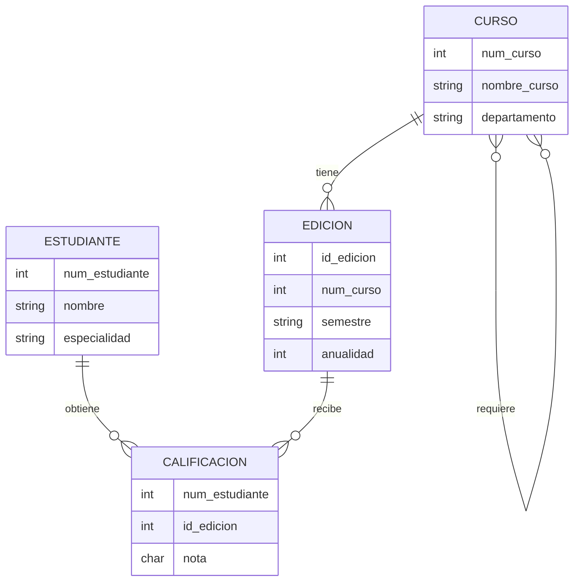
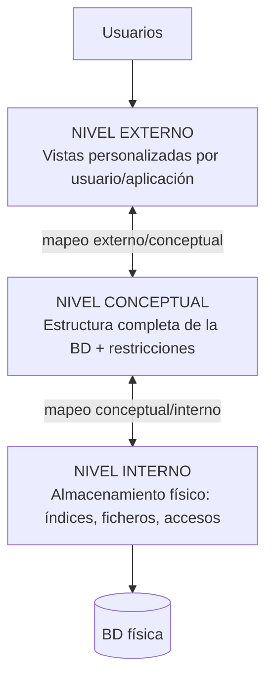

# Tema 1 — Fundamentos de Bases de Datos (Resumen para repaso)

> [!info] Cómo usar este resumen
> Este documento condensa los conceptos esenciales del Tema 1. Cada sección termina con la idea clave en una frase. Al final tienes una tabla de autoevaluación: si sabes responder a todas las preguntas, dominas el tema.

## Contenidos

1. Conceptos básicos
2. Modelos de datos
3. Esquema vs. estado de una base de datos
4. Sistemas Gestores de Bases de Datos (SGBD)
5. Usuarios de bases de datos
6. Ventajas del enfoque de base de datos
7. Cuándo NO usar una base de datos

---

## 1. Conceptos básicos

Cinco definiciones que debes dominar (todo el tema se construye sobre ellas):

| Término                      | Definición                                                                                                                                |
| ---------------------------- | ----------------------------------------------------------------------------------------------------------------------------------------- |
| **Datos**                    | Hechos conocidos que pueden registrarse y tienen un significado implícito.                                                                |
| **Mini-mundo**               | La parte del mundo real que decidimos representar. Ej.: los expedientes académicos de una universidad.                                    |
| **Base de datos (BD)**       | Una colección de datos *relacionados* (sobre un mini-mundo).                                                                              |
| **SGBD (DBMS)**              | El *software* que facilita crear, gestionar y mantener bases de datos.                                                                    |
| **Sistema de base de datos** | SGBD + base de datos (y, a veces, las aplicaciones que los usan).                                                                         |
| **Metadatos**                | Información que describe cómo está definida y estructurada una base de datos, incluyendo sus estructuras, tipos de datos y restricciones. |

> **Idea clave**: la base de datos son los *datos*; el SGBD es el *software* que los gestiona. No los confundas.

> [!exercise]+ Ejercicio de calentamiento
> ¿Qué datos guardarías sobre la entidad *Persona* en estos mini-mundos?
> - Un banco (la persona es un *cliente*)
> - Spotify (la persona es un *usuario oyente*)
> - Un hospital (la persona es un *paciente*)
>
> Observa cómo el **mismo objeto real** genera **datos distintos** según el mini-mundo.

---

## 2. Modelos de datos

### 2.1. Qué es un modelo de datos

Un **modelo de datos** es una notación para describir datos. Define **cómo se organizan, documentan y definen** los datos de un sistema. Consta de **tres partes**:

1. **Estructura**: las construcciones para definir el *esquema* — elementos y sus tipos, agrupaciones (entidad, registro, tabla) y relaciones entre ellas.
2. **Operaciones**: qué se puede hacer con los datos. Suelen ser un conjunto *limitado*: **consultas** (recuperar) y **modificaciones** (cambiar). Esta limitación es una **fortaleza**: permite al programador expresar operaciones a alto nivel y al SGBD ejecutarlas de forma eficiente y optimizada — algo mucho más difícil en un lenguaje de propósito general como C o Java.
3. **Restricciones**: condiciones que los datos deben cumplir en todo momento para garantizar la **integridad** de la BD. Ej.: "un día de la semana es un entero entre 1 y 7".

> **Idea clave**: modelo de datos = estructura + operaciones + restricciones.

### 2.2. Evolución (visión rápida)

| Época | Modelos | Situación |
|---|---|---|
| Años 60 | Jerárquico, en red | Heredados (legacy) |
| Años 70 → hoy | **Relacional** | Paradigma dominante desde entonces |
| Años 2010 → hoy | NoSQL (documentos, grafos, columnas, clave-valor) | Respuesta al *Big Data*: grandes volúmenes, alta velocidad, datos no estructurados (texto, vídeo, sensores IoT, redes sociales) |

### 2.3. Niveles de modelado

Se modela en **tres niveles de abstracción**, de más humano a más máquina:

| Nivel | Describe... | Audiencia | Ejemplo |
|---|---|---|---|
| **Conceptual** (alto nivel) | Entidades principales y sus relaciones generales; cercano a la percepción humana | Negocio + técnicos (se dibuja en una pizarra) | Modelo Entidad-Relación |
| **Lógico** (de implementación) | Entidades con sus atributos detallados; **independiente del SGBD concreto** | Diseñadores | Modelo relacional |
| **Físico** (bajo nivel) | Cómo se almacenan realmente los datos; **específico de un SGBD** | Administradores/optimización | Índices, ficheros |

> **Idea clave**: conceptual → qué existe; lógico → con qué detalle; físico → cómo se guarda.

---

## 3. Esquema vs. estado de una base de datos

Distinción fundamental (y pregunta clásica de examen):

| | **Esquema** (intención) | **Estado** (extensión) |
|---|---|---|
| Qué es | La **descripción** de la BD: estructura, tipos y restricciones | Los **datos reales almacenados** en un momento dado (también: *instancia* o *snapshot*) |
| ¿Cambia? | Con **muy poca** frecuencia | Con **mucha** frecuencia (en cada actualización) |
| Analogía | El plano de un edificio | Los muebles que hay hoy dentro |

- **Estado inicial**: el estado al cargar la BD por primera vez.
- **Estado válido**: cualquier estado que satisface la estructura y las restricciones del esquema.

### Ejemplo: BD de universidad

Mini-mundo: gestión académica. Entidades: ESTUDIANTE, CURSO, EDICIÓN (de un curso), CALIFICACIÓN, REQUISITO.

El diagrama anterior es el **esquema**. Las filas concretas ("Luis, CC1310, nota C, Otoño 05...") son el **estado**.

---

## 4. Sistemas Gestores de Bases de Datos (SGBD)

### 4.1. Arquitectura de tres niveles

Los SGBD organizan los esquemas en **tres niveles**:

| Nivel | Función | Para quién |
|---|---|---|
| **Externo** (vistas) | Cada grupo de usuarios ve *solo* la porción de datos que le interesa | Usuarios finales y aplicaciones |
| **Conceptual** (lógico) | Estructura completa de la BD, unificada e independiente del almacenamiento | DBAs y diseñadores |
| **Interno** (físico) | Estructuras de almacenamiento, índices, rutas de acceso | Optimización y rendimiento |

Los **mapeos** entre niveles traducen las peticiones de los usuarios (que hablan en términos del esquema externo) a operaciones sobre el nivel interno, y transforman los datos recuperados de vuelta a la vista del usuario.

Esta arquitectura garantiza la **independencia de datos**:

- **Independencia lógica**: puedo cambiar el esquema conceptual sin tocar las vistas externas ni sus aplicaciones.
- **Independencia física**: puedo cambiar el esquema interno (p. ej., crear un índice, reorganizar ficheros) sin tocar el esquema conceptual.

> **Idea clave**: tres niveles + dos mapeos = los cambios en un nivel no arrastran a los demás.

### 4.2. Sistemas autodescriptivos

Un SGBD almacena en su **catálogo/diccionario** la descripción de cada base de datos: estructuras, tipos y restricciones. Esa descripción se llama **metadatos** ("datos sobre los datos").

Consecuencias:
- El **mismo SGBD sirve para bases de datos distintas** (lee su definición del catálogo).
- **Independencia entre aplicaciones y datos**: cambiar la BD no obliga a reescribir las aplicaciones.

Ejemplo: en un SGBD relacional, el propio catálogo son tablas — una tabla RELACIONES (nombre de cada tabla, nº de columnas) y una tabla COLUMNAS (nombre, tipo de dato, a qué tabla pertenece).

### 4.3. Funcionalidad básica de un SGBD

1. **Definir** una BD (tipos, estructuras y restricciones) mediante un lenguaje de definición de datos.
2. **Manipular** la BD: **consultas** (recuperar) y **actualizaciones** (insertar, borrar, modificar).
3. **Almacenar grandes volúmenes durante largos periodos** con acceso eficiente.
4. **Durabilidad**: recuperación frente a fallos, errores o mal uso.
5. **Acceso compartido y concurrente**, evitando interferencias entre usuarios (*aislamiento*) y operaciones a medias (*atomicidad*), manteniendo la *consistencia*.

#### Propiedades ACID

Las transacciones de un SGBD garantizan cuatro propiedades (acrónimo formalizado en 1983 sobre trabajos pioneros de Jim Gray en procesamiento de transacciones):

| Letra | Propiedad | Garantiza que... |
|---|---|---|
| **A** | Atomicidad | Una transacción se ejecuta **completa o no se ejecuta** (nunca a medias). |
| **C** | Consistencia | La BD pasa siempre **de un estado válido a otro estado válido** (se cumplen todas las restricciones). |
| **I** | Aislamiento | Las transacciones concurrentes **no interfieren** entre sí; el resultado es como si se ejecutaran una tras otra. |
| **D** | Durabilidad | Una vez confirmada una transacción, sus cambios **sobreviven a cualquier fallo** posterior. |

> **Idea clave**: ACID es lo que hace confiable a una BD en escenarios críticos (banca, reservas, comercio electrónico).

### 4.4. Clasificación de los SGBD

Cuatro dimensiones **ortogonales** (independientes entre sí):

| Dimensión | Valores posibles |
|---|---|
| **Modelo de datos** | Heredado (jerárquico, red) · Actual (relacional, objeto-relacional) · Reciente (NoSQL: documentos, grafos, columnas, clave-valor) |
| **Nº de usuarios** | Usuario único · Multiusuario |
| **Nº de procesos** | Un solo proceso (biblioteca embebida) · Proceso separado (servidor cliente-servidor) |
| **Nº de sistemas** | Centralizado · Distribuido |

Aplicado a SGBD reales:

| SGBD | Modelo | Usuarios | Procesos | Sistemas |
|---|---|---|---|---|
| PostgreSQL | Relacional/Objeto-relacional | Multi | Servidor | Centralizado/Distribuido |
| MySQL | Relacional | Multi | Servidor | Centralizado/Distribuido |
| **SQLite** | Relacional | **Único** | **Biblioteca embebida** | **Centralizado** |
| Oracle | Relacional/Objeto-relacional | Multi | Servidor | Centralizado/Distribuido |
| MongoDB | NoSQL (documentos) | Multi | Servidor | Centralizado/Distribuido |

> **Fíjate en SQLite** (el SGBD de prácticas): es la excepción en las tres últimas dimensiones. No es un servidor: es una *biblioteca* que vive dentro de tu aplicación. Ideal para apps móviles, sistemas embebidos y aplicaciones de escritorio.

> [!exercise]+ Ejercicio
> Busca qué funcionalidades ofrecen SQLite, PostgreSQL y Neo4j, y clasifícalos en las cuatro dimensiones.

---

## 5. Usuarios de bases de datos

Dos grandes grupos: quienes **usan** la BD y sus aplicaciones (usuarios), y quienes **construyen** el software SGBD y las herramientas (proveedores).

### Usuarios

| Rol | Responsabilidad principal |
|---|---|
| **Administrador (DBA)** | Autoriza accesos, coordina y supervisa el uso, adquiere recursos, monitoriza el rendimiento. |
| **Diseñador** | Define contenido, estructura, restricciones y transacciones; habla con los usuarios finales para entender sus necesidades. |
| **Usuario final** | Consulta, genera informes y/o actualiza datos. Cuatro perfiles: **ocasional** (accede esporádicamente), **simple/paramétrico** (usa transacciones "enlatadas": un cajero de banco, un usuario de app móvil), **avanzado** (analistas, científicos que conocen a fondo el sistema), **autónomo** (mantiene BD personales, p. ej. su biblioteca de fotos). |
| **Profesional TI** | Analistas de sistemas (capturan requisitos y diseñan aplicaciones) y programadores (las implementan y prueban). |

### Proveedores

Diseñadores/desarrolladores del propio SGBD, desarrolladores de herramientas (modelado, monitorización...) y operadores/personal de mantenimiento de la infraestructura.

---

## 6. Ventajas del enfoque de base de datos

Las nueve ventajas, agrupadas por lo que aportan:

**Sobre los datos:**
1. **Persistencia**: los datos sobreviven a la ejecución del programa (almacenamiento no volátil).
2. **Relaciones complejas**: representación natural de relaciones 1:1, 1:N y N:M mediante claves.
3. **Integridad**: restricciones que se aplican automáticamente para mantener datos correctos y consistentes.
4. **Control de redundancia**: cada dato se almacena una sola vez (mediante *normalización*) → sin inconsistencias ni desperdicio.

**Sobre el rendimiento y la concurrencia:**
5. **Optimización de consultas**: el SGBD elige automáticamente el plan de ejecución más eficiente (índices, orden de uniones...), de forma transparente al usuario.
6. **Compartición y transacciones**: control de concurrencia para que múltiples usuarios operen simultáneamente sin corromper datos (propiedades ACID).

**Sobre el acceso:**
7. **Múltiples interfaces**: lenguajes de consulta (SQL), interfaces gráficas, APIs (JDBC/ODBC), herramientas de informes — cada perfil de usuario tiene la suya.
8. **Seguridad**: autenticación (¿quién eres?) + autorización (¿qué puedes hacer? — GRANT/REVOKE).
9. **Backup y recuperación**: copias de seguridad programadas y restauración a un estado consistente tras un fallo.

> **Idea clave**: el SGBD te da "gratis" (ya implementado y probado) todo lo que tendrías que programar a mano con ficheros planos.

---

## 7. Cuándo NO usar una base de datos

Un SGBD no siempre es la respuesta. Dos costes a considerar: **complejidad operacional** (administración, configuración, mantenimiento) y **latencia inherente** (capas de abstracción, bloqueos, transacciones).

| Escenario | Por qué evitar el SGBD | Alternativa |
|---|---|---|
| Datos estáticos y simples (configuraciones, catálogos pequeños) | La sobrecarga supera el beneficio | JSON, CSV, ficheros |
| Prototipos y MVPs | Iterar rápido sin diseñar esquemas | Ficheros planos |
| Tiempo real crítico (trading de alta frecuencia, control industrial) | Cada microsegundo cuenta; se necesita determinismo | Acceso directo a memoria |
| Sistemas embebidos muy limitados (microcontroladores, wearables) | Incluso SQLite puede ser excesivo | Almacenamiento ultraligero |
| Datos altamente especializados (grafos masivos, datos científicos multidimensionales, streaming masivo) | Los SGBD generalistas no encajan | Sistemas especializados (p. ej. HDF5) |

> [!info] Conclusión
> Los casos para evitar un SGBD han disminuido con el tiempo (soluciones ligeras como SQLite cubren muchos huecos), pero siguen existiendo nichos. La clave: equilibrar la **simplicidad inmediata** contra la **flexibilidad futura**, sabiendo que migrar después a un SGBD puede exigir una refactorización importante.

---

## Autoevaluación rápida

Si respondes a todas sin mirar arriba, el tema está dominado:

1. ¿Cuál es la diferencia entre *base de datos*, *SGBD* y *sistema de base de datos*?

Una base de datos es una colección de datos relacionados, mientras que SGBD es el software que gestiona la base de datos. El sistema de base de datos está compuesto por el SGBD y la base de datos, y en ocasiones también por las aplicaciones que la utilizan. 

2. ¿Cuáles son las tres partes de un modelo de datos?

Un modelo de datos está compuesto por tres partes: una estructura, unas operaciones y una serie de restricciones.

3. ¿Por qué limitar las operaciones de un modelo de datos es una fortaleza y no una debilidad?

Porque de esa forma el programador puede expresar las operaciones a alto nivel y el SGBD realizarlas de manera más eficiente.

4. ¿Qué diferencia hay entre modelo conceptual, lógico y físico? ¿Cuál es independiente del SGBD?

Son las diferentes capas de abstracción. La más alta, el modelo conceptual, es el esquema que sigue el modelo de datos y es lo más cercano a la percepción humana.
El siguiente es el modelo lógico, que elabora una estructura concreta a partir del esquema según un modelo de datos y es independiente del SGBD. 
En último lugar, el más bajo, está el modelo físico, que describe cómo se almacenan los datos.

5. ¿Qué es el esquema y qué es el estado de una BD? ¿Cuál cambia más a menudo?

El esquema es la definición o estructura de una BD, incluyendo sus tipos de datos y restricciones. No suele cambiar mucho.
El estado de una BD es el conjunto de datos que existen en una BD en un momento determinado. Cada vez que se insertan, modifican o eliminan datos, el estado de la BD cambia.

6. Enumera los tres niveles de la arquitectura de un SGBD y explica los dos tipos de independencia de datos.

Los tres niveles de la arquitectura son el externo, el conceptual y el interno. El nivel externo, destinado a los usuarios, está formado por la vista del usuario de la BD.
En el nivel conceptual, destinado a los diseñadores, se encuentra la estructura de la base de datos al completo con las restricciones pertinentes.
En el nivel interno, destinado a la optimización y al rendimiento, se encuentra el almacenamiento físico de la BD.

Tipos de independencia de datos: independencia de datos lógica y física.
La independencia de datos lógica consiste en que un cambio en el esquema conceptual no cambia las vistas de los usuarios, mientras que la independencia de datos física consiste en que un cambio en el esquema interno de la BD no cambia el esquema conceptual. 

7. ¿Qué son los metadatos y por qué decimos que un SGBD es "autodescriptivo"?

Los metadatos son información de la BD acerca de su definición y estructura, tipos de datos y restricciones; se encuentra en el catálogo o diccionario de la BD. En consecuencia, podemos decir que un SGBD es autodescriptivo porque el mismo SGBD sirve para bases de datos distintas y porque existe independencia entre las aplicaciones y los datos, es decir, que los cambios en la definición de los datos no obligan a modificar las aplicaciones.

8. Explica cada letra de ACID con un ejemplo bancario.

A: Atomicidad. Quiere decir que una operación puede realizarse al completo o no ejecutarse, pero no quedarse en un punto intermedio.

C: Consistencia. La BD siempre pasa de un estado válido a otro válido, es decir, siempre se cumplen las restricciones.

I: Aislamiento. No hay posibilidad de que dos operaciones que se ejecutan a la vez interfieran ya que se considera que va una detrás de la otra.

D: Durabilidad. Una vez una operación haya sido completada, los cambios producidos permanecen pese a los fallos que pueda haber.

Un ejemplo podría ser que se fuera la luz en mitad de una compra de una entrada de un concierto. Si se cumplen las propiedades ACID, o se ejecutó la operación al completo o no se ejecutó nada, de forma que es imposible que te quedes sin el dinero y sin la entrada porque si se completó los cambios permanecen y si no se completó a tiempo es como si no hubieras intentado comprarla siquiera.

9. ¿En qué se diferencia SQLite de PostgreSQL según las cuatro dimensiones de clasificación?

SQLite se diferencia de PostgreSQL en que el modelo de datos no es objeto-relacional, es sólo relacional; en que es de usuario único y centralizado, mientras que PostgreSQL puede ser centralizado o distribuido. La diferencia más importante es que SQLite funciona como una biblioteca embebida y no se interactúa con un servidor.

10. Da dos escenarios donde NO usarías un SGBD y justifica por qué.

No usaría un SGBD para proyectos simples en los que no haya una gran cantidad de datos que mantener, en cuyo caso no sería rentable añadir la complejidad que supone trabajar con un SGBD cuando existen alternativas más sencillas y ligeras como ficheros, etc.

Otro escenario en el que no usaría un SGBD sería para aplicaciones con requisitos de rendimiento extremo, donde la sobrecarga introducida por el SGBD pueda ser contraproducente.